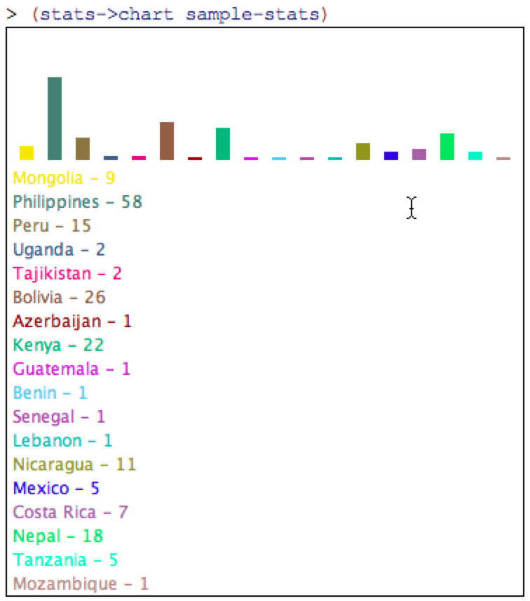
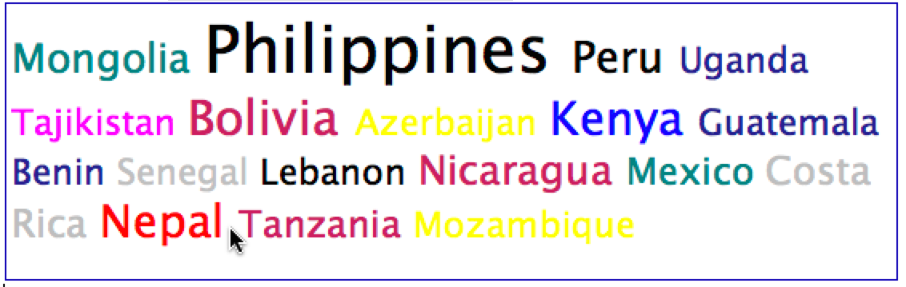
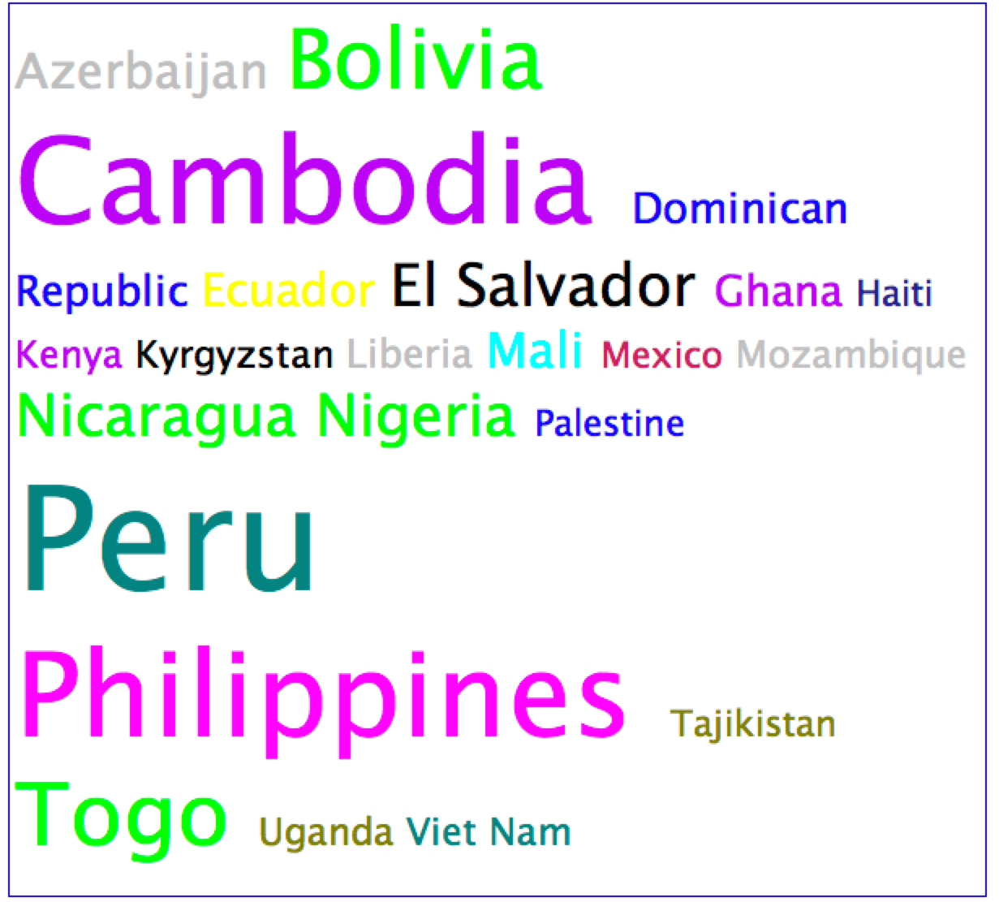

# "Real Data" : Microfinance Borrowers
**[Data: Lists of structures + Abstract List Functions]**

[Kiva.org](http://www.kiva.org/) connects individuals with microfinance opportunities in the developing world. Small business owners in developing countries request loans through Kiva. Kiva advertises these requests and lets individuals contribute small amounts to borrowers of their choice.

In these exercises, you will develop data definitions for key Kiva information and functions to process that information. You will also hook up your code to the Kiva website, so you can test your code on Kiva's actual data. This is a big part of what you'd need to do to write custom scripts or mashups based on Kiva's data.

For many of the tasks, using an appropriate abstract list processing function will get you through them quickly; but in every case, if you get stuck, you can always fall back to using the appropriate template for the parameters of your function.

## Data Definitions

1. Information about a borrower consists of their name, size of team, home country, type of business/activity, requested amount, and amount of the requested amount raised so far. Develop the data definition(s), examples, template(s), etc. that you will need for representing and processing information about a list of borrowers.

## Functions

2. Write a function `funds-needed` that consumes a list of borrowers and produces the total amount of money that these borrowers are still seeking (i.e., the sum of the amounts requested but not yet raised across all borrowers).

3. Write a function `find-by-country` that consumes a country and a list of borrowers and returns the list of borrowers who are from that country.

## Connecting to Data

Here is a function that uses the Sinbad library to connect to the Kiva API and retrieve a page of information about the latest loan statuses. 

````
(require sinbad)

(define (get-kiva-page page-number)
  (local [(define ds (sail-to "https://api.kivaws.org/v1/loans/newest.json"
                              (param "page" page-number)
                              (param "app_id" "edu.berry.cs.sinbad")
                              (cache-timeout (* 24 60 60))  ; refresh downloaded day daily
                              (load)))]
    (fetch ds
           (make-borrower ... ... ... ... ... ...)
           (base-path "loans"))))
````

4. Fill in the `(make-borrower ...)` expression with the names of the following fields in the appropriate order for how you defined your `borrower` structure:
   - `"name"` : borrower's name
   - `"borrower_count"` : size of team
   - `"location/country"` :  borrower's home country
   - `"activity"` : type of business/activity
   - `"loan_amount"` : requested amount of money
   - `"funded_amount"` : amount of money raised so far

   Try typing `(get-kiva-page 1)` to get a list of the most recent updates on the Kiva website. Each page of data consists of 20 entries. You can use the following to obtain the total number of pages of data available:

````
(define total-kiva-pages
  (fetch (sail-to "https://api.kivaws.org/v1/loans/newest.json"
                  (param "app_id" "edu.berry.cs.sinbad")
                  (cache-timeout (* 24 60 60))  ; refresh downloaded day daily
                  (load))
         (list "paging/pages")))
````

## More Functions

5. Write a function `search-borrowers` that consumes a list of borrowers and a function from borrower to boolean (ie, a predicate on borrowers) and returns a list of all borrowers for which the function returns true. Use your function to ***redefine*** the body of the `find-by-country` function.

6. Use functions you've already written to write `funds-by-criterion` that consumes a list of borrowers and a predicate on borrowers and produces the total amount that borrowers who satisfy the predicate are still seeking (i.e., the sum of the amounts requested but not yet raised across all borrowers).

7. Write a function `tally-countries` that consumes a list of borrowers and produces a list of pairs, where the first element of each pair is the name of a country and the second element is the number of borrowers from that country. For example (your countries and numbers may not exactly match these):

````
> (tally-countries (get-kiva-page 1))
(list
 (list "Kenya" 1)
 (list "Bolivia" 3)
 (list "Mozambique" 2)
 (list "Senegal" 1)
 (list "Tajikistan" 4)
 (list "Sierra Leone" 1)
 (list "Paraguay" 2)
 (list "Tanzania" 2)
 (list "Nicaragua" 1)
 (list "Costa Rica" 1))
````

8. Write a function `sort-by-need` that consumes a list of borrowers and produces a summary of how much funding is needed per country (over all countries represented in the list), with the summary results sorted by decreasing need. Entries in your summary should indicate both the country and the amount required. Compose existing functions where you can to write this, without worrying about the efficiency of your solution. You may use ISL's built-in [quicksort](http://docs.racket-lang.org/htdp-langs/intermediate.html?q=quicksort#%28def._htdp-intermediate._%28%28lib._lang%2Fhtdp-intermediate..rkt%29._quicksort%29%29) function.

9. Write a function `get-kiva-pages : Number Nat -> [listof Borrower]` that retrieves the given (natural) number of pages of data from the Kiva website, starting with a particular page number. i.e. (get-kiva-pages start-page num-of-pages). Define the function based on the template for natural numbers.

   Please do not use this function with more than 10 pages at a time. Otherwise it will put undue stress on the Berry network and the Kiva servers. (See point #6 on the Kiva API [Code of Conduct](https://www.kiva.org/build/code-of-conduct) page.) You can call this function once in your file and assign the result to a constant, to be used in test cases:

        (define LIVE-DATA (get-kiva-pages 1 5)) ;; first five pages of current data from Kiva
        
See what results the functions you have written above produce when applied to `LIVE-DATA`.


## Graphs and Clouds

After finishing all of the above, **choose one** of the following two exercises (a) or (b). The first one is sufficient for getting full credit for this part of the assignment. The second option is more challenging and you will receive extra credit if you complete it successfully.

### Option A

Develop a function, `stats->chart`, that consumes the statistics produced by the `tally-countries` function above (step 7) and produces a colored bar chart, complete with legend. For example:



where

````
(define sample-stats
  (list
   (list "Mongolia" 9)
   (list "Philippines" 58)
   (list "Peru" 15)
   (list "Uganda" 2)
   (list "Tajikistan" 2)
   (list "Bolivia" 26)
   (list "Azerbaijan" 1)
   (list "Kenya" 22)
   (list "Guatemala" 1)
   (list "Benin" 1)
   (list "Senegal" 1)
   (list "Lebanon" 1)
   (list "Nicaragua" 11)
   (list "Mexico" 5)
   (list "Costa Rica" 7)
   (list "Nepal" 18)
   (list "Tanzania" 5)
   (list "Mozambique" 1)))
````

Select the colors of the country names randomly from a list of colors that is some subset you choose of this list of valid [color names](https://cs.berry.edu/webdocs-common/csc120/docs/colors.html). Note that the colors in the bars have to match the colors of the labels in the legend.


### Option B

***(very challenging)*** 

Develop a function, `stats->cloud`, that consumes the statistics produced by the `tally-countries` function above (step 7) and produces a word cloud of the data. You can come up with whatever approach you want for the layout of your [word cloud](http://en.wikipedia.org/wiki/Word_cloud), but it should have the names of the countries broken up onto multiple lines based on a fixed width. Here is an example:

      (stats->cloud sample-stats)
      


The font size of the country names should be proportional to the tally number in the list of stats. Select the colors of the country names randomly from a list of colors that is some subset you choose of this list of valid [color names](https://cs.berry.edu/webdocs-common/csc120/docs/colors.html).

You can use the built-in `quicksort` function to write a function that sorts the countries list alphabetically before building the word cloud, as in the following (note that I violated my own suggestion here to not get more than 10 pages of Kiva data -- but I only ran this code once in the Interactions window, and it took several minutes before it accumulated all the data and produced the result):

      (stats->cloud (sort-stats (tally-countries (get-kiva-pages 1 50))))
      



----

Credits: This set of problems was adapted from exercises developed by Kathi Fisler. The Kiva teachpack developed by Shriram Krishnamurthy et al. was the original inspiration for the development of the Sinbad library.


