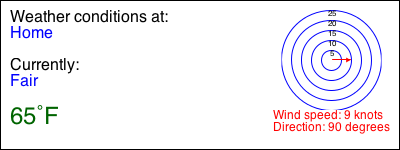

# "Real Data" Activity: Structures with Weather Data
**[Data: Simple structures]**

## Prep: Data Definitions for Structures

As you start this activity, you should know that a *structure* is a programming language mechanism to combine several pieces of data into a single piece of compound data.

Let's start off by defining a structure representing weather observation data. There are naturally several pieces of information that we'd like to collect together to represent a weather observation. Design a data definition for a structure that captures the following information (to be consistent with the rest of this activity, please maintain the order that these pieces are listed when you define your fields):
- name of the location/weather station
- latitude
- longitude
- temperature in Fahrenheit degrees
- wind direction
- wind speed in knots
- text description of the weather, e.g. "Fair", "Rain", etc.

For example, the following: `(make-obs "Home" 34.3 -85.2 65 90 9 "Fair")` represents an observation at "Home" (located at 34.3, -85.2) as having a temperature of 65 degrees F, with wind blowing East (90&deg;) at 9 knots, and the conditions are fair. Define a couple of examples of data, for instance:

````
(define HOME-OBS (make-obs "Home" 34.3 -85.2 65 90 9 "Fair"))
(define WORK-OBS (make-obs "Work" 33.2 -85.15 62 83 8 "Fair"))
````

A complete sample data definition is provided at the very bottom of this page, but write out your own first and then compare.


## Fetching Structures

Let's set up a data source as in our previous activities:

````
(require sinbad)

(define STN-CODE "KRMG")

(define ds
  (sail-to (string-append "http://weather.gov/xml/current_obs/" STN-CODE ".xml")
           (cache-timeout 300)
           ;(manifest)
           (load)))
````

Fetching a structure from a data source is not much different than what you've previously done. In a prior activity, you learned how to apply a function to pieces of data as they are fetched from the data source. Since one of the things that you get with a structure definition is a *constructor* function, we'll just use that as the function to apply to the labels of interest from the data. We have to make sure that the order of the labels we extract from the data **exactly matches** the order of the fields in your structure definitions (the names don't make a difference).

Add this line to your program:

````
(define current-obs
  (fetch ds (make-obs "location" "latitude" "longitude" "temp_f" "wind_degrees" "wind_kt" "weather")))
````

Then, run the file and inspect `current-obs` in the Interactions area. It should look something like:

````
(make-obs "Rome, R. B. Russell Airport, GA" 34.34778 -85.16111 61 10 8 "Fair")
````

with different numbers and text, of course. Note that with all those numbers floating around in there, it's important that your data definition clearly provides an *interpretation* of the pieces of the structure along with well-chosen field names, to make it easier for other people (and yourself) to understand and work with your code.


## Exercises

1. Airport runways are numbered according to their compass heading. Usually, the exact compass bearing is rounded to the nearest 10 degrees and then the value is divided by 10. That means a runway numbered 36 is facing approximately due north (360 degrees on the compass). A runway numbered 13 is facing southeast. Here's [an example of runway layouts](http://wiki.opengeofiction.net/wiki/images/8/88/Runways_examples.png).

   In a previous activity, you should have written functions `is-headwind?` and `is-tailwind?`. Copy those function definitions into your file for this activity. Run the file to make sure they still work and pass all tests.

   Now, design functions `tailwind-on-runway?` and `headwind-on-runway?` that take a runway number and a weather observation structure and produce true if there is a tailwind, or headwind as appropriate, relative to that runway's heading. For example, `(tailwind-on-runway? 9 WORK-OBS)` should produce `true` for the definition of `WORK-OBS` above -- the wind is blowing almost the same direction as the runway heading. Note that for there to be a tailwind/headwind, the wind speed must not be zero. In that case (if wind speed is 0), there is neither a headwind nor a tailwind.
   
2. Define a function `obs->image` that takes a weather observation (structure) and produces an graphical representation of the information. For example, you might produce the image below as the result of `(obs->image HOME-OBS)`. Use your `wind-graphic` function from a previous activity. I used a background scene of 400x150 pixels and `place-image/align` to position the different components of the image. 

   
   
   (Since this function results in a rather complex image, your instructor may permit you to test this function interactively rather than using `check-expect` to test its correctness -- ask about it.)
   
   Try applying your function to weather observations obtained live from different NWS stations.
   
3. If the name of a location is very long, it may not look very nice in the image produced by your code in the previous exercise. Design a function `split-if-longer` that takes a string and a number. If the length of the string is longer than the number, then the function produces a string with "\n" inserted in the middle of the given string. ("\n" is the newline character). For example, `(split-if-longer "abcdefg" 6)` produces `"abc\ndefg"`, while `(split-if-longer "abcdefg" 16)` produces the same string, unchanged. (Hint: look up operations like `string-length`, `substring`, `string-append`, and `floor`.)

   Incorporate your `split-if-longer` function into your `obs->image` function. For example, split the location name if it is longer than 40 characters.
   
4. As in a previous exercise, set up a second data source and load an observation from it:

        (define STN-CODE-2 "KATL")

        (define ds-2
          (sail-to (string-append "http://weather.gov/xml/current_obs/" STN-CODE-2 ".xml")
                   (cache-timeout 300)
                   (load)))

        (define current-obs-2
          (fetch ds-2 (make-obs "location" "latitude" "longitude" "temp_f" "wind_degrees" "wind_kt" "weather")))

   
   Design a function named `obs-temp-compare` that takes two observation (structures) and produces a string describing the relative difference between the temperature of the first and the second. For example, `(obs-temp-compare HOME-OBS WORK-OBS)` for the definitions of `HOME-OBS` and `WORK-OBS` given above should produce a string `"The temperature at Home is slightly warmer than the temperature at Work."`
   
   (Hint: Use your definition of the `temp-compare` function from a previous activity.)


## Suggested Data Definition

````
;; A WeatherObs is a structure:
;;   (make-obs String Number Number Number String Number String)
;; interpretation: current weather conditions at the station identified
;;   by name and latitude/longitude coordinates.
;;   temp is in degrees Fahrenheit
;;   wind-dir is the angle in degrees from N the wind is blowing
;;   wind-speed is in Knots
;;   conditions is a textual description of the weather
(define-struct obs (name lat lng temp wind-dir wind-speed conditions))

; Examples
(define HOME-OBS (make-obs "Home" 34.3 -85.2 65 90 9 "Fair"))
(define WORK-OBS (make-obs "Work" 33.2 -85.15 62 83 8 "Fair"))

; template
(define (obs-func an-obs ...)
  (... (obs-name an-obs)
       (obs-lat an-obs)
       (obs-lng an-obs)
       (obs-temp an-obs)
       (obs-wind-dir an-obs)
       (obs-wind-speed an-obs)
       (obs-conditions an-obs) ...))
````
